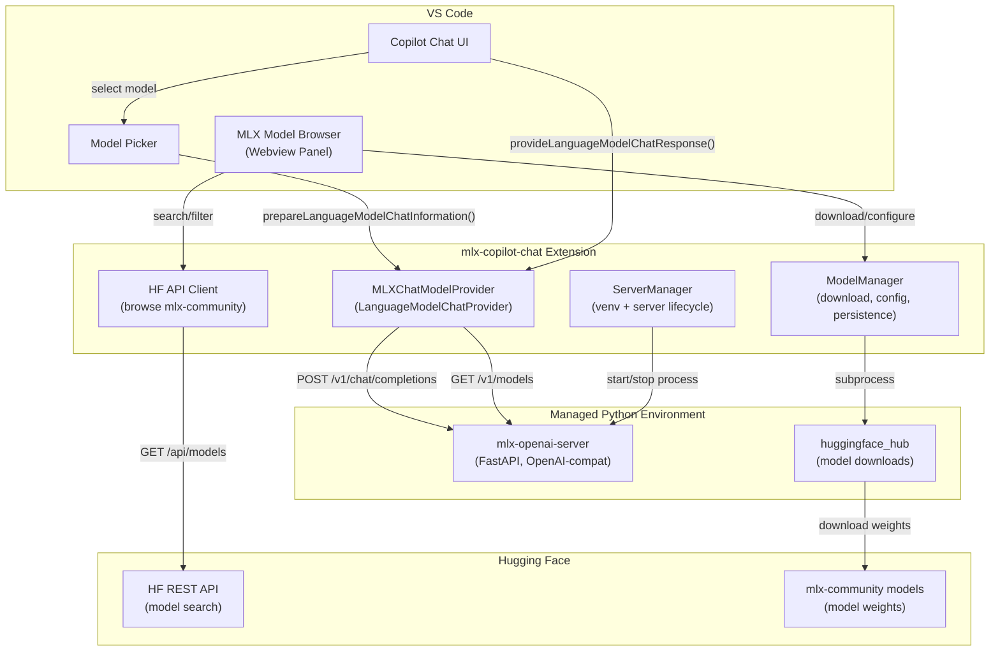
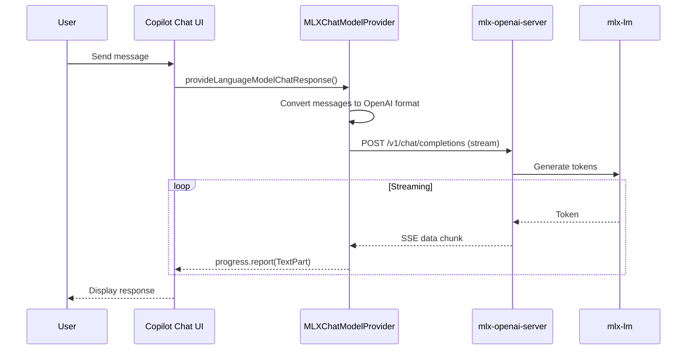

# MLX Copilot Chat Extension

## Overview

Build a VS Code extension (this repo: `copilot-local-model-provider`) that brings local MLX models into VS Code Copilot Chat. The extension registers as a `languageModelChatProvider` (like the [Hugging Face extension](huggingface-vscode-chat/src/extension.ts)), manages a Python environment with `mlx-openai-server` for inference, and provides a webview for browsing/downloading models from HF's `mlx-community`.

## Architecture




## Key Decision: Use mlx-openai-server

Rather than building a FastAPI server from scratch, the extension uses [mlx-openai-server](https://github.com/cubist38/mlx-openai-server) (v1.6.3, MIT license, 20K+ monthly PyPI downloads). It already provides:

- OpenAI-compatible `/v1/chat/completions` and `/v1/models` endpoints
- Streaming SSE responses
- Multi-model support via YAML config
- Configurable context length, temperature, quantization
- Request queuing and performance features

The extension generates and manages the YAML config file, and starts/stops the server process.

## Project Structure

```
copilot-local-model-provider/
├── package.json                    # Extension manifest
├── tsconfig.json
├── webpack.config.js               # Webpack build (outputs to dist/)
├── .vscodeignore
├── src/
│   ├── extension.ts                # Activation, provider + command registration
│   ├── provider.ts                 # MLXChatModelProvider (LanguageModelChatProvider)
│   ├── serverManager.ts            # Python venv setup, mlx-openai-server lifecycle
│   ├── modelManager.ts             # Model download, config persistence, YAML generation
│   ├── hfClient.ts                 # HF REST API client (search/filter mlx-community)
│   ├── modelBrowser.ts             # Webview panel (browse, download, configure models)
│   ├── types.ts                    # Shared TypeScript types
│   ├── utils/
│   │   ├── python.ts               # Python detection and management
│   │   ├── validation.ts           # Model validation and checksums
│   │   └── downloadQueue.ts        # Download queue management
│   ├── vscode.d.ts                 # VS Code proposed API types
│   └── test/
│       ├── serverManager.test.ts
│       ├── modelManager.test.ts
│       ├── hfClient.test.ts
│       ├── provider.test.ts
│       └── e2e.test.ts
├── python/
│   ├── download_model.py           # Model download script (huggingface_hub)
│   ├── list_local_models.py        # Enumerate downloaded models with metadata
│   ├── validate_model.py           # Model integrity validation
│   └── requirements.txt            # mlx-openai-server, huggingface_hub
├── media/
│   ├── modelBrowser.js             # Webview UI script
│   ├── modelBrowser.css            # Webview styles
│   └── icon.png                    # Extension icon
├── docs/
│   ├── installation.md
│   ├── quickstart.md
│   ├── models.md
│   ├── configuration.md
│   ├── troubleshooting.md
│   └── faq.md
└── README.md
```

## Implementation Phases

### Phase 1: Extension Scaffold and Python Environment

**Goal:** Working extension that can set up a Python venv and install dependencies.

#### 1. Scaffold package.json

Register as a `languageModelChatProvider` with vendor `mlx`:

```json
{
  "name": "copilot-local-model-provider",
  "displayName": "MLX Copilot Chat",
  "description": "Bring local Hugging Face MLX models into VS Code Copilot Chat",
  "version": "0.0.1",
  "engines": {
    "vscode": "^1.110.0"
  },
  "categories": ["Other"],
  "activationEvents": [
    "onLanguageModelChatProvider:mlx",
    "onCommand:mlx-copilot.manage",
    "onCommand:mlx-copilot.browseModels"
  ],
  "main": "./dist/extension.js",
  "contributes": {
    "languageModelChatProviders": [{
      "vendor": "mlx",
      "displayName": "MLX (Local)",
      "managementCommand": "mlx-copilot.manage"
    }],
    "commands": [
      { "command": "mlx-copilot.manage", "title": "Manage MLX Models" },
      { "command": "mlx-copilot.browseModels", "title": "MLX: Browse Models" },
      { "command": "mlx-copilot.startServer", "title": "MLX: Start Server" },
      { "command": "mlx-copilot.stopServer", "title": "MLX: Stop Server" }
    ],
    "configuration": {
      "type": "object",
      "title": "MLX Copilot",
      "properties": {
        "mlx-copilot.pythonPath": {
          "type": "string",
          "default": "",
          "description": "Custom Python interpreter path"
        },
        "mlx-copilot.serverPort": {
          "type": "number",
          "default": 8741,
          "description": "Port for mlx-openai-server"
        },
        "mlx-copilot.autoStartServer": {
          "type": "boolean",
          "default": true,
          "description": "Auto-start server when model is selected"
        },
        "mlx-copilot.modelStoragePath": {
          "type": "string",
          "default": "",
          "description": "Custom model storage directory"
        },
        "mlx-copilot.maxDownloadRetries": {
          "type": "number",
          "default": 3,
          "description": "Maximum download retry attempts"
        },
        "mlx-copilot.serverRestartAttempts": {
          "type": "number",
          "default": 3,
          "description": "Maximum server restart attempts"
        }
      }
    }
  },
  "scripts": {
    "vscode:prepublish": "npm run package",
    "compile": "webpack",
    "watch": "webpack --watch",
    "package": "webpack --mode production --devtool hidden-source-map",
    "compile-tests": "tsc -p . --outDir out",
    "watch-tests": "tsc -p . -w --outDir out",
    "pretest": "npm run compile-tests && npm run compile && npm run lint",
    "lint": "eslint src",
    "test": "vscode-test"
  },
  "devDependencies": {
    "@types/vscode": "^1.110.0",
    "@types/mocha": "^10.0.10",
    "@types/node": "22.x",
    "typescript-eslint": "^8.56.1",
    "eslint": "^9.39.3",
    "typescript": "^5.9.3",
    "ts-loader": "^9.5.4",
    "webpack": "^5.105.3",
    "webpack-cli": "^6.0.1",
    "@vscode/test-cli": "^0.0.12",
    "@vscode/test-electron": "^2.5.2"
  }
}
```

#### 1a. TypeScript Configuration (tsconfig.json)

Align with existing repo config. Webpack outputs to `dist/`; `compile-tests` uses `tsc --outDir out` for tests:

```json
{
  "compilerOptions": {
    "module": "Node16",
    "target": "ES2022",
    "lib": ["ES2022"],
    "sourceMap": true,
    "rootDir": "src",
    "strict": true,
    "esModuleInterop": true,
    "skipLibCheck": true
  }
}
```

#### 1b. Webpack Configuration (webpack.config.js)

The repo already uses webpack. Ensure `webpack.config.js` matches this pattern (entry, output to `dist/`, ts-loader, vscode external):

```javascript
//@ts-check
'use strict';

const path = require('path');

/** @typedef {import('webpack').Configuration} WebpackConfig **/

/** @type WebpackConfig */
const extensionConfig = {
  target: 'node',
  mode: 'none',
  entry: './src/extension.ts',
  output: {
    path: path.resolve(__dirname, 'dist'),
    filename: 'extension.js',
    libraryTarget: 'commonjs2'
  },
  externals: {
    vscode: 'commonjs vscode'
  },
  resolve: {
    extensions: ['.ts', '.js']
  },
  module: {
    rules: [
      {
        test: /\.ts$/,
        exclude: /node_modules/,
        use: [{ loader: 'ts-loader' }]
      }
    ]
  },
  devtool: 'nosources-source-map',
  infrastructureLogging: { level: "log" },
};
module.exports = [extensionConfig];
```

#### 2. Build serverManager.ts

Manages the Python environment and server process:

- `detectPython()`: Detect Python version and compatibility (requires 3.11+)
- `ensureEnvironment()`: Creates venv in `context.globalStorageUri`, runs `pip install -r requirements.txt`
- `startServer(config)`: Spawns `mlx-openai-server launch` with arguments or `--config <yaml>` for multi-model mode
- `stopServer()`: Sends SIGTERM to the server process
- `restartServer()`: Graceful restart with max 3 attempts
- `isRunning()`: Health check via `GET http://localhost:{port}/v1/models`
- `handleServerCrash()`: Auto-restart on crash with exponential backoff
- Emits events: `onServerStarted`, `onServerStopped`, `onServerError`

#### 3. Create python/requirements.txt

```

mlx-openai-server>=1.6.0
huggingface_hub>=0.25.0

```

#### 4. Create python/validate_model.py

```python
import json
import sys
from pathlib import Path

def validate_model(model_path: str) -> dict:
    """Validate model files and return validation result."""
    path = Path(model_path)
    result = {"valid": True, "errors": []}
    
    # Check for config.json
    config_file = path / "config.json"
    if not config_file.exists():
        result["valid"] = False
        result["errors"].append("Missing config.json")
    
    # Check for model files
    safetensors_file = path / "model.safetensors"
    if not safetensors_file.exists():
        result["valid"] = False
        result["errors"].append("Missing model.safetensors")
    
    return result

if __name__ == "__main__":
    model_path = sys.argv[1]
    result = validate_model(model_path)
    print(json.dumps(result))
```

### Phase 2: Model Management and HF Integration

**Goal:** Browse, download, and configure MLX models.

#### 5. Build hfClient.ts

Search HF models via REST API (no API key required for public models):

- `searchModels(query, filters, sort, limit)`: Calls `GET https://huggingface.co/api/models?library=mlx&author=mlx-community&search={query}&sort={sort}&limit={limit}`
- `getModelInfo(modelId)`: Calls `GET https://huggingface.co/api/models/{modelId}` for detailed metadata
- `getModelPreview(modelId)`: Get model preview before downloading
- Filter options: task type, parameter count range, quantization level (from tags)
- Sort options: trending, downloads, likes, recently updated
- `checkModelUpdates(modelId)`: Check for model updates

#### 6. Build modelManager.ts

Download and configure models:

- `downloadModel(modelId)`: Spawns Python subprocess running `download_model.py` with progress reporting via stdout JSON lines
- `getDownloadedModels()`: Reads from persisted state (`globalState`) + validates model directories exist
- `validateModel(modelId)`: Validates downloaded model integrity
- `configureModel(modelId, config)`: Persists per-model settings in `globalState`
- `removeModel(modelId)`: Deletes model directory and removes from state
- `generateServerConfig()`: Produces `mlx-openai-server` YAML config from all configured models
- `getModelPerformance(modelId)`: Get performance metrics for model
- Default model storage: `~/.cache/huggingface/hub/` (standard HF cache, reuses existing downloads)

#### 7. Create python/download_model.py

Uses `huggingface_hub.snapshot_download()` with JSON-lines progress output:

```python
from huggingface_hub import snapshot_download
import json, sys

model_id = sys.argv[1]
max_retries = int(sys.argv[2]) if len(sys.argv) > 2 else 3

for attempt in range(1, max_retries + 1):
    try:
        path = snapshot_download(model_id)
        print(json.dumps({"status": "complete", "path": path}))
        sys.exit(0)
    except Exception as e:
        if attempt < max_retries:
            print(json.dumps({"status": "retry", "attempt": attempt, "error": str(e)}))
        else:
            print(json.dumps({"status": "failed", "error": str(e)}))
            sys.exit(1)
```

#### 8. Per-model configuration schema

Stored in `globalState`:

```typescript
interface MLXModelConfig {
  modelId: string;           // e.g. "mlx-community/Qwen3-8B-4bit"
  localPath: string;         // resolved path on disk
  displayName: string;       // human-friendly name
  contextLength: number;     // default 4096, user-configurable
  temperature: number;       // default 0.7, user-configurable
  maxOutputTokens: number;   // default 4096
  quantization?: number;     // 4, 8, or 16
  modelType: "lm" | "multimodal";
  enabled: boolean;          // whether to load in server
  group?: string;            // model group for organization
  favorite: boolean;         // mark as favorite
}

interface MLXModelCapabilities {
  toolCalling: boolean;
  imageInput: boolean;
  audioInput: boolean;
  videoInput: boolean;
  maxInputTokens: number;
  maxOutputTokens: number;
  inputTokensPerMessage: number;
  inputTokensPerTool: number;
  supportsSystemMessages: boolean;
  supportsToolMessages: boolean;
}
```

### Phase 3: Model Browser Webview

**Goal:** Rich UI for discovering, downloading, and configuring MLX models.

#### 9. Build modelBrowser.ts

VS Code Webview panel:

- Opens via `mlx-copilot.browseModels` command or from `mlx-copilot.manage`
- Two-tab layout: **Browse** (HF catalog) and **Downloaded** (local models)
- **Browse tab**: Search bar, filter dropdowns (task, param size, quantization), sort selector, paginated model cards with download button
- **Downloaded tab**: List of local models with configuration controls (context size slider, temperature slider, enable/disable toggle, delete button)
- **Groups tab**: Model organization with drag-and-drop reordering
- Communication via `postMessage` / `onDidReceiveMessage` between webview and extension

#### 10. Webview UI (media/)

- Model cards showing: name, parameter count, quantization, download count, size estimate
- Download progress bar per model
- Configuration panel for each downloaded model
- Server status indicator (running/stopped) with start/stop button
- Model group management
- Performance metrics display

### Phase 4: Chat Provider Integration

**Goal:** Downloaded MLX models appear in Copilot Chat's model picker and handle chat requests.

#### 11. Build provider.ts

`MLXChatModelProvider` implementing `LanguageModelChatProvider`:

```typescript
class MLXChatModelProvider implements LanguageModelChatProvider {
  async prepareLanguageModelChatInformation(options, token) {
    // Return LanguageModelChatInformation[] for each enabled downloaded model
    // Auto-start server if not running (unless silent)
  }

  async provideLanguageModelChatResponse(model, messages, options, progress, token) {
    // Convert VS Code messages to OpenAI format
    // POST to mlx-openai-server at http://localhost:{port}/v1/chat/completions
    // Stream SSE response back via progress.report()
  }

  async provideTokenCount(model, text, token) {
    // Use model-specific tokenizer for accurate token count
  }
}
```

#### 12. Message conversion

Adapt from `huggingface-vscode-chat/src/utils.ts`:

- `convertMessages()`: VS Code `LanguageModelChatMessage[]` to OpenAI format
- `convertTools()`: VS Code tool definitions to OpenAI tool format
- Handle streaming SSE parsing (text parts, tool calls)

#### 13. Model capabilities

Each model reports:

- `toolCalling: false` initially (MLX models generally lack structured tool calling; revisit later)
- `imageInput: true` for multimodal models
- `maxInputTokens` / `maxOutputTokens` from user configuration

### Phase 5: Polish and Integration

#### 14. Server auto-lifecycle

- Auto-start server when a model is selected in the chat picker
- Auto-stop server when VS Code closes (via `deactivate()`)
- Status bar item showing server state + active model
- Graceful model switching (update YAML config, restart server)
- Server crash recovery with exponential backoff (max 3 attempts)

#### 15. Error handling

- Clear messaging when Python is not installed
- Guidance when Apple Silicon is not detected
- Download failure recovery (resume partial downloads via HF hub)
- Server crash recovery with restart
- Network error retry with exponential backoff
- Graceful degradation when server is unavailable

#### 16. Configuration settings

In `contributes.configuration`:

- `mlx-copilot.pythonPath`: Custom Python interpreter path
- `mlx-copilot.serverPort`: Server port (default 8741)
- `mlx-copilot.modelStoragePath`: Custom model storage directory
- `mlx-copilot.autoStartServer`: Auto-start on model selection (default true)
- `mlx-copilot.maxDownloadRetries`: Maximum download retry attempts (default 3)
- `mlx-copilot.serverRestartAttempts`: Maximum server restart attempts (default 3)

#### 17. Testing

Add test files:

- `src/test/serverManager.test.ts` - Server lifecycle tests
- `src/test/modelManager.test.ts` - Model download/config tests
- `src/test/hfClient.test.ts` - HF API client tests
- `src/test/provider.test.ts` - Provider integration tests
- `src/test/e2e.test.ts` - End-to-end tests

#### 18. Documentation

Create documentation files:

- `docs/installation.md` - Installation guide
- `docs/quickstart.md` - Quick start guide
- `docs/models.md` - Model management guide
- `docs/configuration.md` - Configuration guide
- `docs/troubleshooting.md` - Troubleshooting guide
- `docs/faq.md` - FAQ

#### 19. Build/Deploy

Scripts and build config are defined in Phase 1. The repo uses webpack; `npm run package` produces `dist/extension.js` for publishing.

Align `.vscodeignore` with the repo (exclude source, build config; ship `dist/`, `media/`, `python/`):

```
.vscode/**
.vscode-test/**
out/**
node_modules/**
src/**
.gitignore
.yarnrc
webpack.config.js
vsc-extension-quickstart.md
**/tsconfig.json
**/eslint.config.mjs
**/*.map
**/*.ts
**/.vscode-test.*
```

## Data Flow: Chat Request




## What We Reuse vs. Build

- **Reuse** `mlx-openai-server` (PyPI) -- OpenAI-compatible server for MLX inference
- **Reuse** `huggingface_hub` (PyPI) -- model downloads with resumption and progress
- **Build** lightweight HF REST client -- search/filter mlx-community models (no auth needed)
- **Adapt** message conversion from `huggingface-vscode-chat/src/utils.ts`
- **Build** `LanguageModelChatProvider` following `huggingface-vscode-chat` pattern
- **Build** custom webview panel for model browsing/configuration
- **Build** Python venv creation + pip install logic

## Risks and Mitigations

- **Large model downloads (10-50GB):** Use HF hub's resumable downloads; show progress; let user pick quantized (smaller) variants
- **Python version incompatibility:** Detect Python version at activation; require 3.11+; guide user to install
- **Non-Apple-Silicon machines:** Detect arch at activation; show clear error that MLX requires Apple Silicon
- **mlx-openai-server API changes:** Pin minimum version in requirements.txt; test against specific version
- **Server port conflicts:** Configurable port with fallback to random available port
- **Tool calling limitations:** Initially report `toolCalling: false`; ask/edit modes will work but agent mode won't. Can add tool-call emulation later.

## Suggested Build Order

1. **Phase 1** -- establish project skeleton and Python environment management
2. **Phase 2** -- core model management (download, configure, persist)
3. **Phase 3** -- browser UI (now before chat integration)
4. **Phase 4** -- end-to-end chat integration (get it working)
5. **Phase 5** -- polish, error handling, status bar

